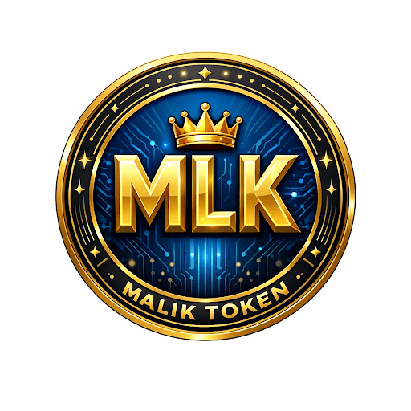

# 🪙 Malik Token (MLK) Ecosystem
> **The Future of Secure and Decentralized Financial Solutions.**

## 🌐 Navigation
[English](#-english) | [کوردی](#-kurdi) | [العربية](#-العربية) | [中文](#-中文) | [Português](#-português)

---

## 🇬🇧 English

### 📝 Overview
**Malik Token (MLK)** is a high-performance utility token built on blockchain technology. It serves as the fuel for the **Malik Ecosystem**, facilitating instant cross-border transactions and securing the decentralized infrastructure.

### 🚀 Key Features
* **Hyper-Secure:** Multi-layered encryption for all digital assets.
* **Seamless Integration:** Native support for **Malik Wallet** and **Malik Exchange**.
* **Instant Settlement:** Optimized for rapid transaction confirmation.

### 🛠 Technical Stack
* **Framework:** Flutter (Dart)
* **Protocol:** Web3 / Smart Contracts (EVM Compatible)
* **Security:** FlutterSecureStorage & AES Encryption

---

## ☀️ کوردی

### 📝 کورتەیەک
**Malik Token (MLK)** تۆکنێکی بەهێزە لەسەر تەکنەلۆژیای بلۆکچەین. وەک بڕبڕەی پشتی **Malik Ecosystem** کار دەکات بۆ ئاسانکاری لە گواستنەوەی دارایی و دابینکردنی ژینگەیەکی ناواوەندی پارێزراو.

### 🚀 تایبەتمەندییە ناوازەکان
* **پارێزگاریی بەرز:** بەکارهێنانی نوێترین تەکنیکەکانی کۆدکردن (Encryption).
* **هەماهەنگی سیستم:** بەستراوەتەوە بە **Malik Wallet** و **Malik Exchange**.
* **خێرایی بێوێنە:** جێبەجێکردنی مامەڵەکان لە کەمترین ماوەدا.

---

## 🇸🇦 العربية

### 📝 نظرة عامة
**Malik Token (MLK)** هو رمز خدمات عالي الأداء يعتمد على تقنية البلوكشين. يعمل كمحرك أساسي لنظام **Malik Ecosystem**، مما يسهل المعاملات المالية الفورية ويؤمن البنية التحتية اللامركزية.

### 🚀 المميزات الرئيسية
* **أمان فائق:** تشفير متعدد الطبقات لجميع الأصول الرقمية.
* **تكامل تام:** دعم أصلي لـ **Malik Wallet** و **Malik Exchange**.
* **تسوية فورية:** تم تحسينه لتأكيد المعاملات بسرعة البرق.

---

## 🇨🇳 中文

### 📝 项目概况
**Malik Token (MLK)** 是一种基于区块链技术的高性能实用代币。它是 **Malik 生态系统** 的核心，旨在促进即时跨境交易并确保去中心化基础设施的安全。

### 🚀 核心特性
* **超高安全性：** 为所有数字资产提供多层加密。
* **无缝集成：** 原生支持 **Malik 钱包** 和 **Malik 交易所**。
* **即时结算：** 针对快速交易确认进行了优化。

---

## 🇧🇷 Português

### 📝 Visão Geral
**Malik Token (MLK)** é um token de utilidade de alta performance construído em tecnologia blockchain. Ele serve como combustível para o **Malik Ecosystem**, facilitando transações instantâneas e garantindo a segurança da infraestrutura descentralizada.

### 🚀 Principais Recursos
* **Hiper-Seguro:** Criptografia em várias camadas para ativos digitais.
* **Integração Nativa:** Suporte total para **Malik Wallet** e **Malik Exchange**.
* **Liquidação Instantânea:** Otimizado para confirmação rápida de transações.

---

## 👨‍💻 Developer & Visionary
**Ares Barznjy**
*Blockchain Architect & Mobile Developer*

---

## 📜 License & Copyright
Copyright © 2026 **Malik Ecosystem**. All rights reserved.
Licensed under the **MIT License**.
